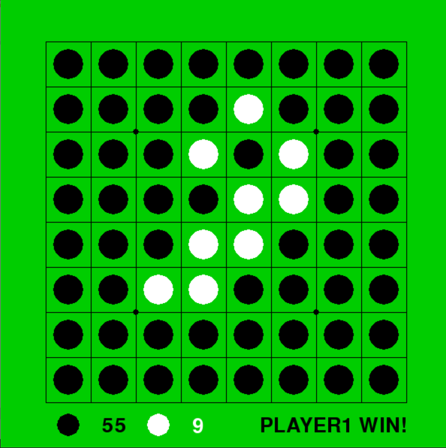

othelloRL
==============

強化学習を用いたオセロAIの作成を目的とする．
<br />


Pythonの必須ライブラリ (動作確認時のバージョン)
-----
- numpy (1.18.1)
- matplotlib (3.1.3)
- pytorch (1.6.0)
- pygame (1.9.6)
<br />
<br />

参考
-----
https://github.com/algolab-inc/tf-dqn-simple 
<br />
https://github.com/TadaoYamaoka/creversi_gym/blob/master/creversi_gym/dqn.py


使用方法
-----

```
python othello_game.py
```

を実行するとオセロを始めることができる．
左クリックで石を置く．

```
python self_game.py
```

だとAIだけの対戦が見られる．
左クリックで試合を動かすことができる

**実際のオセロゲームの動作**

- **ゲーム開始時**

 

- **ゲーム途中時**

 

- **ゲーム終了時**

 
<br />
<br />

