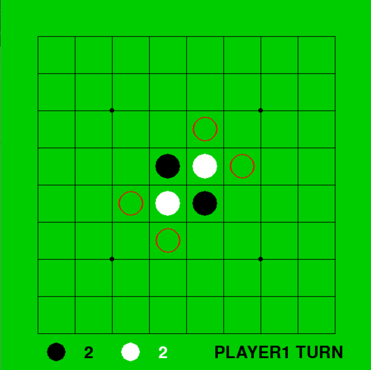

othelloRL
==============

強化学習を用いたオセロAIの作成を目的とする．
<br />
<br />
<br />

# 現在の進捗

### 1. 簡単なゲーム環境でDQN実装
### 2. オセロゲームの作成
<br />
<br />

Pythonの必須ライブラリ (動作確認時のバージョン)
-----
- numpy (1.18.1)
- matplotlib (3.1.3)
- pytorch (1.3.1)
- pygame (1.9.6)
<br />
<br />


## 1. 簡単なゲーム環境でDQN実装
<br />

https://github.com/algolab-inc/tf-dqn-simple のコードをpytorchで動作するように書き換えた．

`catch-ball`と呼ばれる簡単なゲーム環境を学習するための強化学習アルゴリズムとして，DQN(Deep Q Network)の原理を利用している．

(参考：http://blog.algolab.jp/post/2016/08/01/tf-dqn-simple-1/)
<br />
<br />

使用方法
-----
`data`フォルダを作成し，

```
python test.py
```

を実行するとDQNが学習を始め，学習終了後にテストを行う．
テスト時は，DQNがゲームをしている結果がアニメーションとしてGIF形式で`data`フォルダに保存される．

**1000エポックDQNを学習させた結果のDQNの動作アニメーション**

  
<br />
<br />

## 2. オセロゲームの作成

`pygame`によりオセロゲームを作成した．
現在は対戦相手には`RandomAI`(合法手からランダムに一手を選択)のみ実装している．
<br />
<br />

使用方法
-----

```
python othello.py
```

を実行するとオセロを始めることができる．

**実際のオセロゲームの動作**

- **ゲーム開始時**

 

- **ゲーム途中時**

 

- **ゲーム終了時**

 
<br />
<br />

# 今後の課題
- オセロゲームを強化学習アルゴリズムに当てはめるための，`environment`と`agent`の設計
- オセロゲームに活用できる強化学習アルゴリズムの実装
